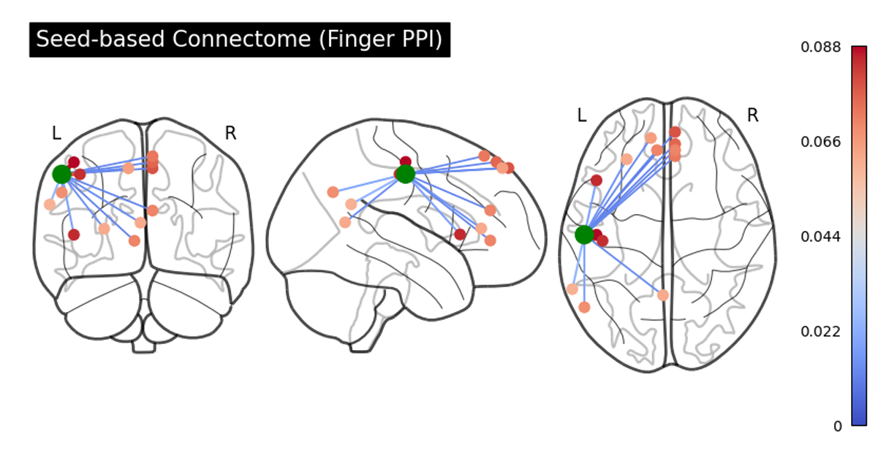

# Somatotopy, Functional Connectivity and the Influence of Handedness in the Human Motor System (fMRI Study)

## Overview
This repository contains the report for an fMRI study investigating the **somatotopic organization**, **task-dependent functional connectivity**, and the **influence of handedness** in the human motor system.

Using task-based functional MRI (fMRI), the study combines **activation analysis (GLM)** and **connectivity analysis (PPI)** to provide a multi-level characterization of motor function.

## Objectives
The project addresses three main questions:

- How are different body parts represented in the primary motor cortex (somatotopy)?
- How does functional connectivity change during motor tasks?
- Does handedness influence the organization of motor networks?

## Dataset and Experimental Design

- **Participants**: 10 adults  
  - 7 right-handed  
  - 3 left-handed  
- **Task**: Block-design motor paradigm  
  - Finger tapping  
  - Foot movement  
  - Lip movement  
- **Structure**:
  - 15s task blocks alternating with 15s rest
  - Two sessions per subject (test–retest)

- **MRI Acquisition**:
  - Scanner: 1.5T GE Signa HDxt  
  - TR = 2500 ms  
  - 30 slices  
  - Voxel size = 4×4×4 mm  

## Methods

### Preprocessing (SPM - MATLAB)
The pipeline includes:

- Slice timing correction  
- Motion correction (realignment)  
- Coregistration (functional → anatomical)  
- Segmentation  
- Normalization to MNI space  
- Spatial smoothing (8 mm FWHM)  

Additional steps:
- Averaging anatomical scans for improved SNR  
- Flipping left-handed subjects to align dominant hemisphere  
- Artifact detection (ART) for motion and outliers  

---

### Activation Analysis (GLM)

- First-level GLM per subject:
  - Task regressors (finger, foot, lips)
  - Motion + artifact regressors
- Contrasts:
  - Task vs baseline  
  - Effector-specific contrasts (e.g. Finger > Others)

- Second-level analysis:
  - One-sample t-tests (group-level inference)

---

### Functional Connectivity (PPI)

Psychophysiological Interaction (PPI) analysis was used to assess **task-dependent connectivity**.

Steps:
1. Define seed ROIs from activation peaks  
2. Extract BOLD time series (VOI)  
3. Build PPI-GLM:
   - Physiological term  
   - Psychological term  
   - Interaction term  
4. Group-level analysis (one-sample t-tests)

---

### Handedness Analysis

- Two-sample t-tests:
  - Right-handers vs Left-handers  
- Analysis performed on:
  - Activation maps  
  - Connectivity maps  

---

## Results

### Somatotopy
- Clear somatotopic organization in primary motor cortex:
  - Fingers → dorsolateral M1  
  - Foot → medial M1 (paracentral lobule)  
  - Lips → bilateral inferolateral regions  

- Functional specialization confirmed via subtraction contrasts  

---

### Lateralization
- **Limbs** → contralateral activation  
- **Lips** → bilateral representation  

This reflects different functional requirements of motor control.

---

### Functional Connectivity

Distinct networks emerged for each effector:

- **Finger movement**  
  → Fronto-parietal network (sensorimotor + executive areas)

- **Foot movement**  
  → Cortico-thalamo-cerebellar loop  
  → Includes SMA, M1, thalamus, cerebellum

- **Lip movement**  
  → Distributed bilateral network  
  → Includes motor, sensory, visual, and associative regions  

---

### Handedness Effects

A key finding is the difference in **network organization**:

- **Right-handers**
  - More focal and specialized connectivity  
  - Strong coupling within sensorimotor circuits  

- **Left-handers**
  - More distributed and bilateral networks  
  - Greater involvement of:
    - Prefrontal cortex  
    - Visual areas  
    - Associative regions  

--> Suggests fundamentally different motor network strategies

## Results Visualization

---

## Key Insights

- Motor cortex organization is **modular and hierarchical**
- Functional connectivity is **task-specific**
- Handedness affects **network architecture**, not just lateralization
- Left-handers show a more **globally integrated system**

---

## Limitations

- Small sample size (especially left-handers)
- Use of 1.5T scanner (limited SNR)
- Exploratory thresholds (no FWE-corrected results)
- Static connectivity (no dynamic analysis)

---

## File
- `fMRI_report.pdf` → Full report

## Author
Federica Maria Olivotto  
Politecnico di Milano  

## Acknowledgments
Prof. Caterina Amendola  
Prof. Eleonora Maggioni  
Politecnico di Milano
